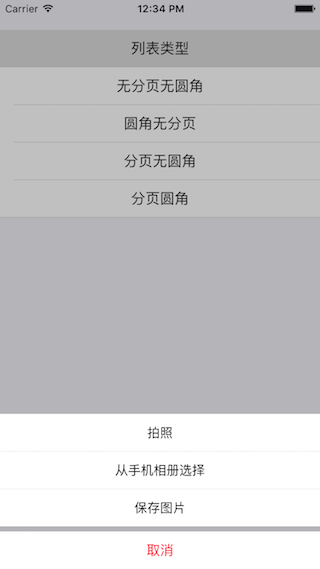
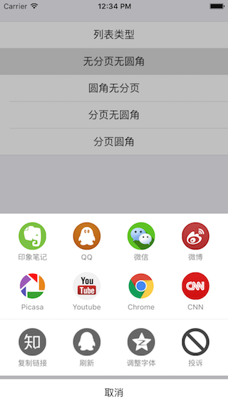
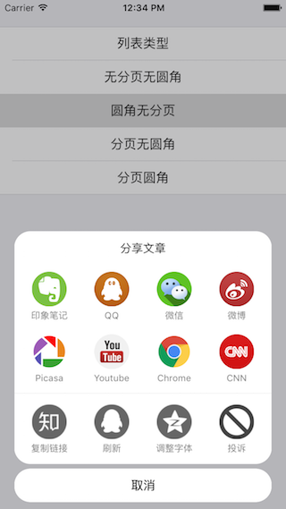
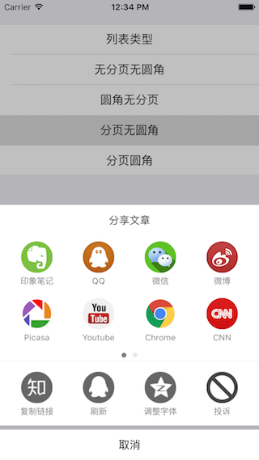
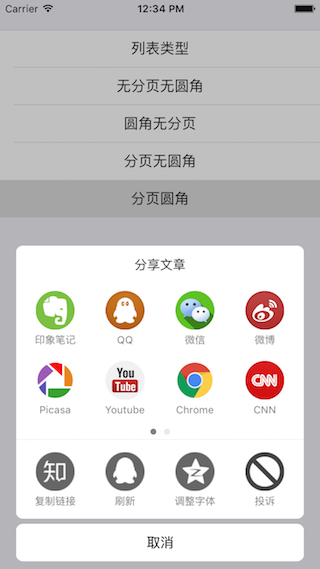

# TTPopupView
&nbsp;
&nbsp;

 
自下而上的弹出菜单框，可实现仿微信弹出菜单列表、QQ、知乎等不同样式分享弹出框。

 
## 样式截图Screenshots
 
###  列表类型

 
###  无分页无圆角类型

 
###  圆角／无分页类型

 
###  分页／无圆角类型

 
###  分页／圆角类型

 
## 安装&使用
###  安装
你可以手动地把项目下的 `TTPopupView` 的文件拷贝到你的项目中使用

 
###  使用

#### 类微信弹出列表样式的初始化
如果要实现一个类似微信弹出列表样式的功能，你可以调用下面的方法：

	NSArray *titles = [[NSArray alloc]initWithObjects:@"拍照",@"从手机相册选择",@"保存图片", nil];
	
	popup = [[TTPopupView alloc]initWithPopupTitle:nil funsTitles:titles click:^(NSInteger buttonIndex) {  
							//处理点击事件
    					}];
 

或者

	popup = [[TTPopupView alloc]initWithPopupTitle:nil funsTitles:titles delegate:self];

来初始化 `TTPopupView` 对象，第二个方式，还需要实现 **TTPopupViewDelegate** 中的方法

	#pragma mark - TTPopupViewDelegate

	-(void)popupView:(TTPopupView *)popup onClick:(NSInteger)index{
		//处理点击事件
	}
	
#### 其他样式的初始化

其他四个样式，是类似QQ、知乎一类应用的分享弹出框，样式可以选择在初始化时通过参数来确定。点击处理的部分和上面一样，可以通过实现  **TTPopupViewDelegate** 中的方法 或者 **block** 来实现
	
	NSArray *shareIcons = @[@"evernote_128px",@"qq_128px",@"wechat_128px",@"weibo_128px",@"google_picasa_128px",
							@"youtube_128px",@"chrome_128px",@"cnn_128px",@"angrybirds_128px"];
    NSArray *shareTitles = @[@"印象笔记",@"QQ",@"微信",@"微博",@"Picasa",@"Youtube",@"Chrome",@"CNN",@"AngryBirds"];
    NSArray *funsIcons = @[@"zhihu_72px",@"qq",@"qzone_72px",@"traffic_sign_forbidden_72px",@"alert_72px"];
    NSArray *funsTitles = @[@"复制链接",@"刷新",@"调整字体",@"投诉",@"查看信息"];

 	popup = [[TTPopupView alloc]initWithStyle:TTPopupViewNormal popupTitle:nil share2Icons:shareIcons share2Titles:shareTitles 					funsIcons:funsIcons funsTitles:funsTitles click:^(NSInteger buttonIndex) {
         		//处理点击事件   
 	 		}];
 	 		
或者
 	 		
	popup = [[TTPopupView alloc]initWithStyle:TTPopupViewNormal popupTitle:nil share2Icons:shareIcons share2Titles:shareTitles 				funsIcons:funsIcons funsTitles:funsTitles delegate:self]；
	
#### 弹出框样式参数：
	 /**
     * 类似分享弹出框，不带pagecontrol控件，无圆角，包含标题（可选）、可分享的第三方平台按钮区（可选，两行四列）、APP自身的功能按钮区（可选，一行）、取消按钮
     */
    TTPopupViewNormal,
    
    /**
     * 类似分享弹出框，带pagecontrol控件，无圆角，包含标题（可选）、可分享的第三方平台按钮区（可选，两行四列）、APP自身的功能按钮区（可选，一行）、取消按钮
     */
    TTPopupViewWithPageControl,
    
    /**
     * 类似分享弹出框，不带pagecontrol控件，有圆角，包含标题（可选）、可分享的第三方平台按钮区（可选，两行四列）、APP自身的功能按钮区（可选，一行）、取消按钮
     */
    TTPopupViewNormalWithCircle,
    
    /**
     * 类似分享弹出框，带pagecontrol控件，有圆角，包含标题（可选）、可分享的第三方平台按钮区（可选，两行四列）、APP自身的功能按钮区（可选，一行）、取消按钮
     */
    TTPopupViewWithPageControlWithCircle
    
#### 其他属性设置
你可以设置弹出框的一些参数，包括标题、分享app、功能标题、取消按钮文字和字体大小及颜色，阴影部分的颜色和透明度，圆角样式下圆角的大小等，这些都要在调用 **show（）**方法之前完成。

      [popup setPopupTitleTextFont:[UIFont systemFontOfSize:15]];
      [popup setPopupTitleTextColor:TTColor(45, 56, 67)];
      [popup setContentTextFont:[UIFont systemFontOfSize:12]];
      [popup setContentTextColor:[UIColor grayColor]];
      [popup setCancelTextColor:[UIColor blackColor]];
      [popup setRadius:8];
        
      [popup show];
####  问题&反馈
- QQ ：364432355
- E-mail ： whtacm@gmail.com
